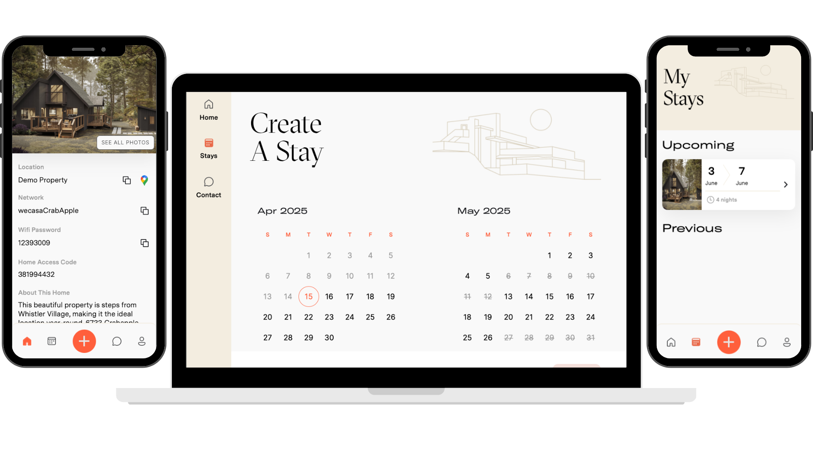

# Wecasa Project Recap

This repository highlights my contributions as a full-stack software developer on the Wecasa platform, a solution designed to simplify and fairly manage luxury vacation home co-ownership.

## 🚨 NDA Disclosure

**Note:** The following project summary is shared in accordance with a non-disclosure agreement (NDA). Specific implementation details, business logic, and client-identifying information have been generalized or omitted.

---

## Full-Stack Developer – Wecasa Application

As a full-stack developer on the Wecasa project, I contributed to building a Rails-based platform that reimagines luxury vacation home co-ownership. The application ensures equitable booking among multiple owners, streamlining operations and enhancing user experience.

### Fair Booking System Implementation

I developed and implemented business rules for a transparent booking system that allocates vacation time fairly among co-owners. This system considers factors such as ownership percentage, seasonal demand, and cancellation history to ensure equitable access for all users.

### Self-Serve Sandbox Environment

To facilitate user onboarding and reduce support requests, I built a self-serve sandbox environment. This feature allows prospective users to sign up, explore the application, and experiment with the booking system, thereby improving product adoption and user engagement.

### Data Flow Optimization and Tool Integration

I enhanced data flow across internal tools and third-party systems, including AWS S3 and an admin dashboard built with Retool. These improvements streamlined operations and provided better insights into platform usage and performance.

### DevOps Advocacy and Implementation

Recognizing the need for robust development operations, I advocated for and helped establish continuous integration (CI) pipelines and observability tooling. These enhancements improved deployment processes and system monitoring, contributing to overall platform reliability.

### Cross-Functional Collaboration

I partnered with marketing and operations teams to prototype, launch, and iterate on new product features. This cross-functional collaboration ensured that the platform met business objectives and user needs effectively.

---

This experience demonstrates my ability to develop complex, user-centric applications, optimize system integrations, and collaborate across teams to deliver impactful software solutions.
